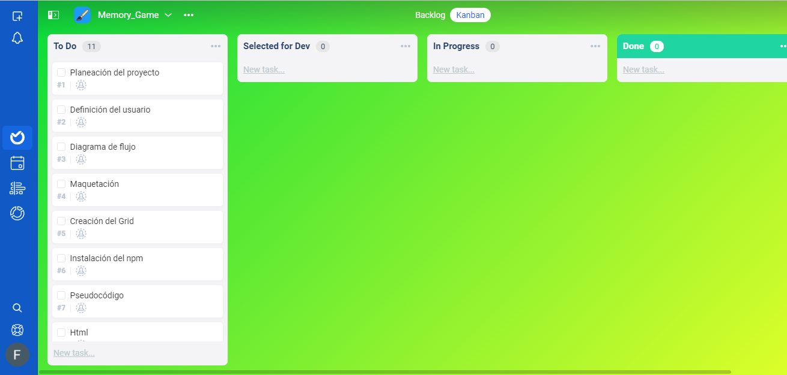

# _Memory Game_

----

## Indice

1. _Descripción_
2. _Definición del Usuario_
3. _Hacker Edition_
4. _Planeación_
5. _Diagrama de flujo_
6. _Maquetación_
7. _Pseudocódigo_
8. _Producto final_

----

## _**Descripción**_

----

## _**Definición del usuario**_

----

## _**Hacker Edition**_

----

## _**Planeación**_

----

## _**Diagrama de flujo**_

----

## _**Maquetación**_

----

## _**Pseudocódigo**_

----

## _**Producto final**
