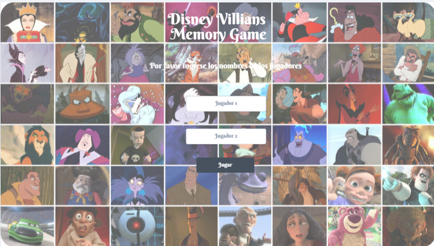
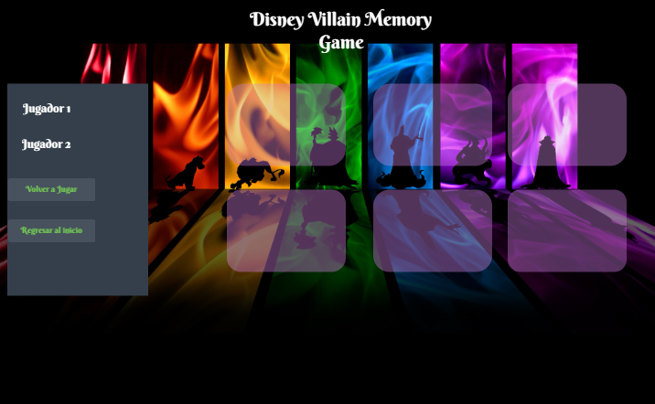

# _Memory Game_

----

## Indice

1. _Descripción_
2. _Definición del Usuario y User Stories_
3. _Hacker Edition_
4. _Planeación_
5. _Diagrama de flujo_
6. _Maquetación_
7. _Pseudocódigo_
8. _Producto final_

----

## **Descripción**

_Aplicación para jugar memorama en línea._

----

## **Definición del usuario y User Stories**

### **Definición del usuario**

Personas que disfruten las peliculas de Disney pero sobretodo a sus villanos.

### **User Stories**

* _Los usuarios quieren jugar un juego en el sitio con un compañero para pasar el tiempo._

* _El usuario quiere tener un juego de memoria que trate sobre algún tema relacionado con sus intereses._

* _El usuario quiere ver al ganador y al perdedor del juego por puntuación, mostrando sus nombres._

* _Debería haber un botón de reinicio para volver a jugar y comenzar un nuevo juego eliminando las puntuaciones pero no los nombres de usuario._

----

## **Hacker Edition**

----

## **Planeación**

----

## **Diagrama de flujo**

----

## **Maquetación**

----

## **Pseudocódigo**

----

## **Producto final**
